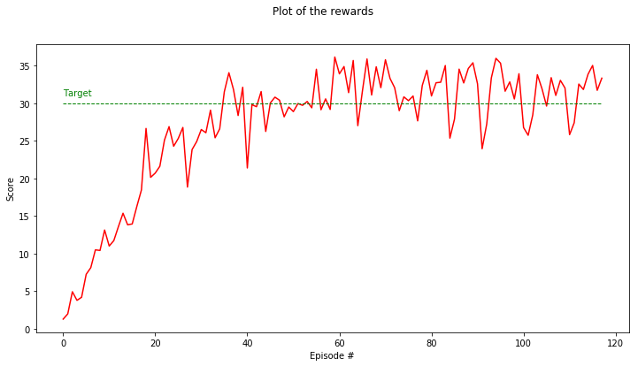

# Continuous Control Project Report

In this project, I used DDPG with 20 agents to the Reacher environment.

### Learning Algorithm
I used the DDPG code Udacity provided in PyTorch and adapted it for 20 agents. The input feature is 33-dimensional.

My work uses Actor-Critic:
- Actor
  1. Linear(in_features=33, out_features=256, bias=True) + Relu activation
  2. Linear(in_features=256, out_features=128, bias=True) + Relu activation
  3. Linear(in_features=128, out_features=4, bias=True) + tanh activation

- Critic
  1. Linear(in_features=33, out_features=256, bias=True) + Relu activation
  2. Linear(in_features=260, out_features=128, bias=True) + Relu activation
  3. Linear(in_features=128, out_features=1, bias=True) + sigmoid activattion

#### Hyperparameter list
- BUFFER_SIZE = int(1e5)  # replay buffer size
- BATCH_SIZE = 128        # minibatch size
- GAMMA = 0.999           # discount factor
- TAU = 1e-3              # for soft update of target parameters
- LR_ACTOR = 1e-3         # learning rate of the actor 
- LR_CRITIC = 1e-3        # learning rate of the critic
- WEIGHT_DECAY = 0        # L2 weight decay
- NOISE_DECAY = 0.999     # for noise decay
- N_UPDATES = 10          # update the networks 10 times
- N_TIME_STEPS = 20       # update the networks every 20 timesteps

### Plot of Results 
The plot below shows the mean score of 20 agents during each episode. The averaged score from episode 18 to 118 is above 30.0.

### Ideas for Future Work
- Further tune the hyperparameters to get higher scores, faster converging, and more robust results.
- Take the more challenging crawler work.
The goal is to find when and where each of the algorithms have the best performance.